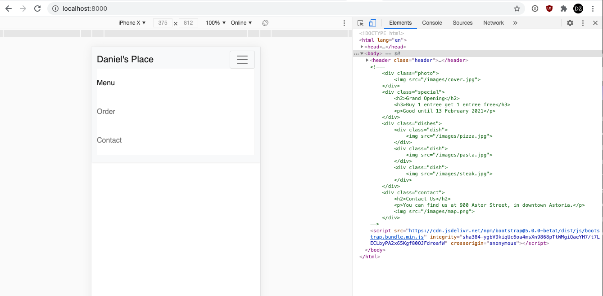
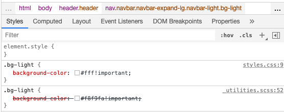
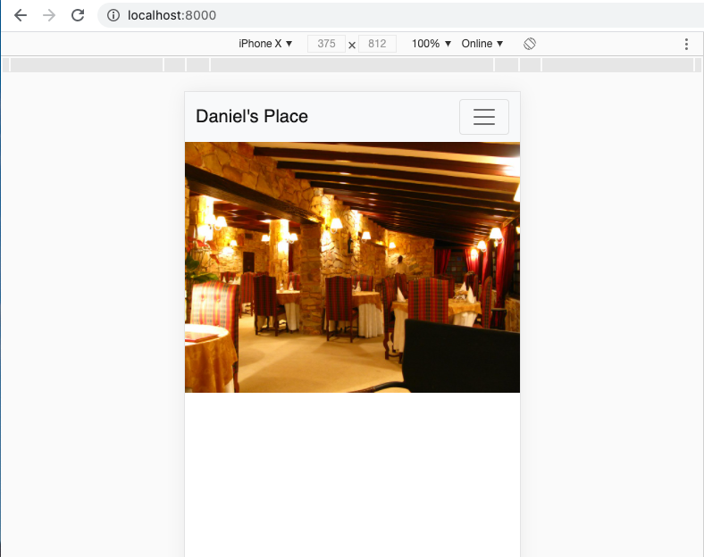
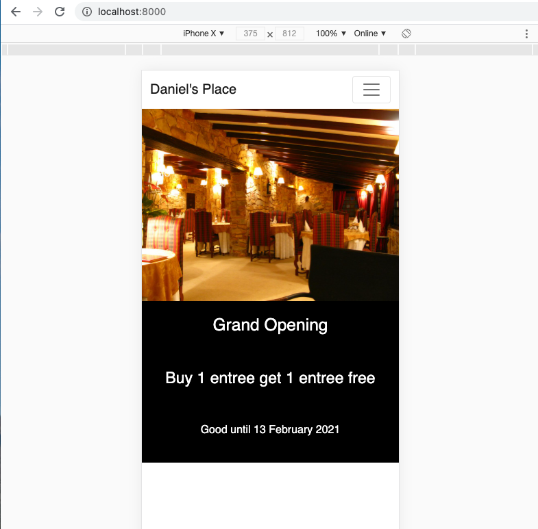
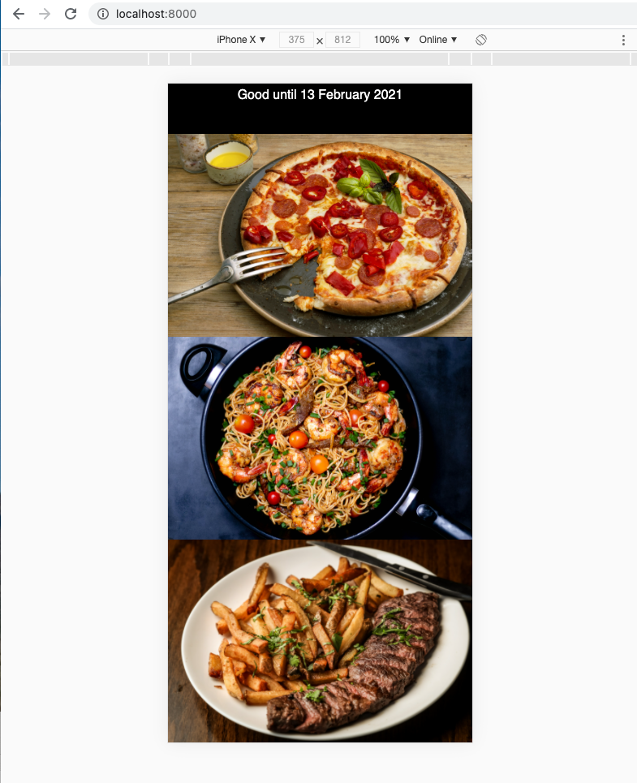
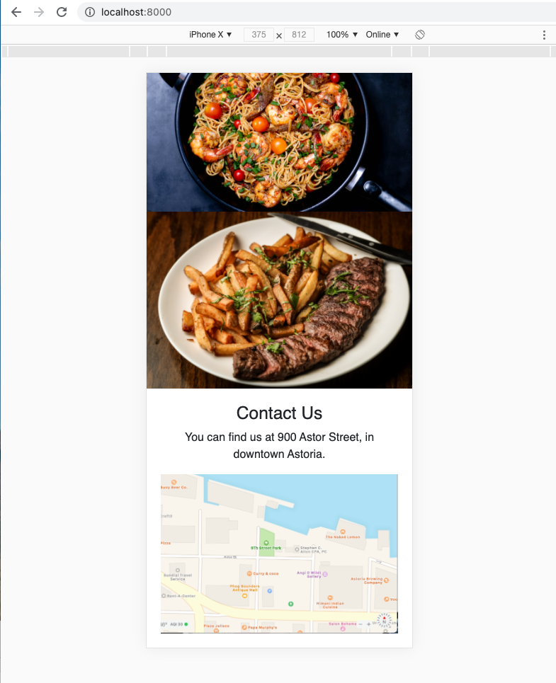
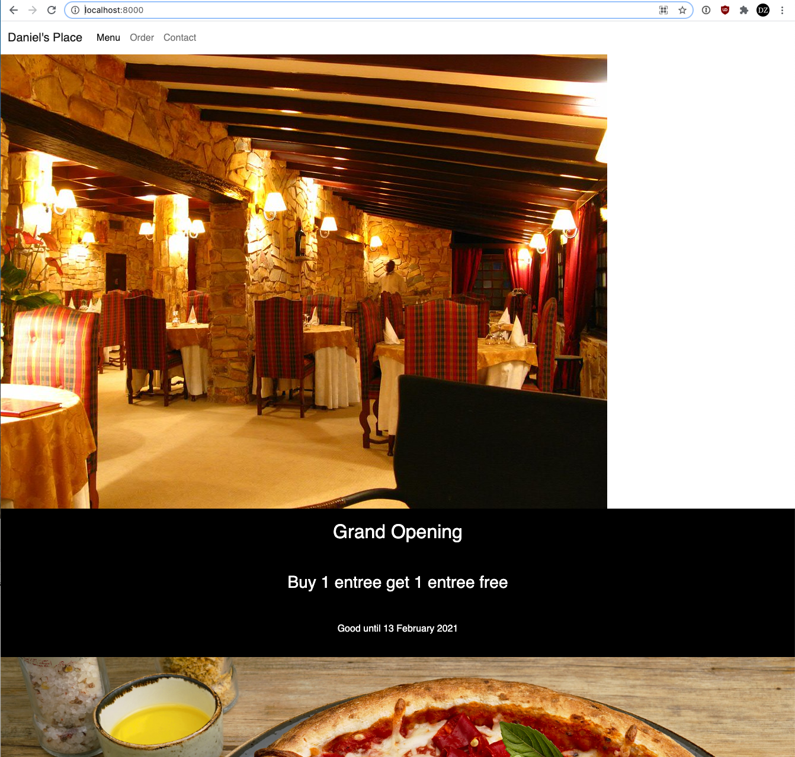
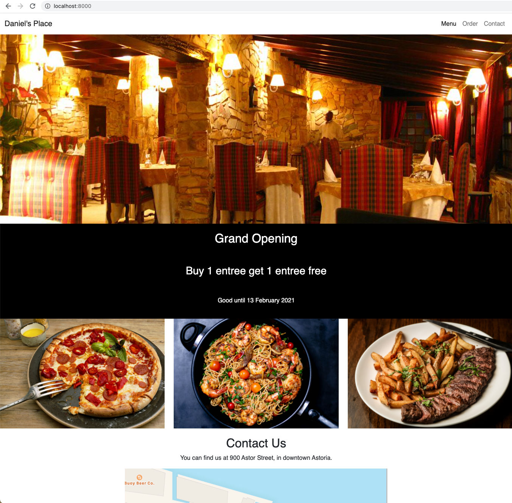

# Tutorial on Responsive Design

In this tutorial, I am going to show you how to develop a page using a *mobile-first, responsive design* using Bootstrap, a common used for website designs. I will assume you have already followed the previous [responsive design tutorial](https://github.com/BYU-CS-260/responsive-design) and will focus on using the [Bootstrap](https://getbootstrap.com) framework. You could follow a similar path using other frameworks, such as [Pure.css](https://purecss.io).

I showed you a pure CSS version in the first tutorial because (a) pure CSS websites are often lighter weight and Bootstrap is particularly large, which can slow down visitors to your websites, especially on mobile phones, and (b) it helps to see how responsive design works so you can understand what frameworks are doing for you.

## HTML Boilerplate

To start with, let's use the same HTML boilerplate, which you can put into a file called `index.html`:

```html
<!DOCTYPE html>
<html lang='en'>
  <head>
    <meta charset='UTF-8'/>
    <meta name='viewport'
      content='width=device-width, initial-scale=1.0, maximum-scale=1.0' />
    <title>Daniel's Place</title>
    <link rel='stylesheet' href='styles.css'/>
  </head>
  <body>
  </body>
</html>
```

and the following styles in `styles.css`:

```css
body {
    margin: 0;
    padding: 0;
    box-sizing: border-box;
}

```

## Adding Bootstrap

The [getting started page](https://getbootstrap.com/docs/5.0/getting-started/introduction/) for Bootstrap shows you how to add Bootstrap to your site. You need to add this link to your `head` section:

```html
<link href="https://cdn.jsdelivr.net/npm/bootstrap@5.0.0-beta1/dist/css/bootstrap.min.css" rel="stylesheet" integrity="sha384-giJF6kkoqNQ00vy+HMDP7azOuL0xtbfIcaT9wjKHr8RbDVddVHyTfAAsrekwKmP1" crossorigin="anonymous">
```

Be sure this link is *before* your `styles.css` so you can override the Bootstrap styles as needed. You also need to add this link to the bottom of your `body` section:

```html
<script src="https://cdn.jsdelivr.net/npm/bootstrap@5.0.0-beta1/dist/js/bootstrap.bundle.min.js" integrity="sha384-ygbV9kiqUc6oa4msXn9868pTtWMgiQaeYH7/t7LECLbyPA2x65Kgf80OJFdroafW" crossorigin="anonymous"></script>
```

JavaScript links should always be at the bottom so that the browser will load the main content before any scripts. For Bootstrap, JavaScript is used for dropdown menus, tooltips, dropdowns, and various other pieces. You can see a list in the getting started document page linked above.

## Logo and menu

With Bootstrap, the easiest way to get a responsive menu is to use their [Navbar](https://getbootstrap.com/docs/5.0/components/navbar/) component. You can find this by opening the Components menu at the let of the page in their documentation.

I copied the first example on the page and then modified it as shown below:

```html
    <header class="header">
        <nav class="navbar navbar-expand-lg navbar-light bg-light">
            <div class="container-fluid">
              <a class="navbar-brand" href="#">Daniel's Place</a>
              <button class="navbar-toggler" type="button" data-bs-toggle="collapse" data-bs-target="#navbarSupportedContent" aria-controls="navbarSupportedContent" aria-expanded="false" aria-label="Toggle navigation">
                <span class="navbar-toggler-icon"></span>
              </button>
              <div class="collapse navbar-collapse" id="navbarSupportedContent">
                <ul class="navbar-nav me-auto mb-2 mb-lg-0">
                  <li class="nav-item">
                    <a class="nav-link active" href="#">Menu</a>
                  </li>
                  <li class="nav-item">
                    <a class="nav-link" href="#">Order</a>
                  </li>
                  <li class="nav-item">
                    <a class="nav-link" href="#">Contact</a>
                  </li>
              </div>
            </div>
          </nav>
    </header>
```

You can see that I replaced `Navbar` with the name of the restaurant, removed the dropdown menu, disabled item, and search box, and put in three basic menu items to mirror our previous site design.

This gives us this menu, while turning on Chrome's responsive design mode:



One of the downsides of using Bootstrap is that you are going to get a site that looks like a bunch of other sites. Normally you should customize this to provide some personalization for your brand. For now, let's simply turn off the light gray background color, to show you the quick and easy way to customize Bootstrap.

Use the Inspector in the developer tools, then click on the `nav` element and look at the styles applied. You should see a `.bg-light` style that applies the gray background. To change this, you could add the following to `styles.css`:

```css
.bg-light {
    background-color: #fff!important;
}
```

Notice that we need to use `!important` here. This is a CSS command telling the browser to override any other styles, even if they come later, and [you shouldn't usually use this](https://css-tricks.com/when-using-important-is-the-right-choice/). In this case, we are forced to so that we can override Bootstrap's use of `!important`. You can see this in action in the Inspector:



This is ugly, but the alternative shown in the [Bootstrap documentation on customization](https://getbootstrap.com/docs/5.0/customize/overview/) requires using Sass and compiling your own Bootstrap library. You can invest some time in learning how to set this up, [use an online tool for generating custom Bootstrap CSS](http://paintstrap.com), or choose a [pure CSS framework](https://purecss.io).

## Cover photo

For the cover photo, we can use Bootstrap's `img-fluid` class to make the image grow to fit the available space:

```html
<div class="photo">
    
</div>
```

We don't need any custom CSS in this case.

Here is what we have so far:



## Special

We can add a grand opening special the same way as the previous tutorial:

```html
<div class="special">
    <h2>Grand Opening</h2>
    <h3>Buy 1 entree get 1 entree free</h3>
    <p>Good until 13 February 2021</p>
</div>
```

with some CSS styles:

```css
.special {
  text-align: center;
  background-color: #000;
  color: #fff;
  padding: 20px;
  margin: 0px;
}

.special h3 {
  margin: 50px 0px;
}
```

Here's what this looks like:



## Dishes

For the dishes, we can reuse the `img-fluid` class:

```html
    <div class="dishes">
        <div class="dish">
            
        </div>
        <div class="dish">
            
        </div>
        <div class="dish">
            
        </div>
    </div>
```

Notice the tradeoff here. With Bootstrap, we are using a predefined helper class, and need to add that to every image. With our own CSS, we can define a style that applies to all images on the site, or all images within the `dishes` div or a `content` div that wraps all the content on a page. You may prefer one or the other.

We now have dishes displayed on our site:



## Contact Information

We can add our contact information the same way as before, while using the `img-fluid` class:

```html
<div class="contact">
    <h2>Contact Us</h2>
    <p>You can find us at 900 Astor Street, in downtown Astoria.</p>
    
</div>
```

```css
.contact {
    text-align: center;
    padding: 20px;
}
```

We also added some padding to the `contact` div because Bootstrap zeroes out the top margin for headings.



## Sizing for larger screens

How does this look if we use a larger screen (turn off the responsive design in the development tools)? The site works just fine, it's just sized to fill the entire browser:



The responsive menu works OK, but you may prefer the right-float on the menu we had before, to give your logo/brand it's own space. The menu also still has the "Bootstrap look" with gray colors and is not customized. In addition, the cover photo isn't filling at 100% because Bootstrap only sizes images to their maximum native resolution. Ideally, we would get a higher resolution photo for our cover image.

Let's add a media query to fix some of these things. We'll start with the menu. If you use the Inspector or look at our HTML you can see this uses the `navbar-nav` class, and this is inside a flexbox, so we can float that right by setting the margins this way:

```css
@media (min-width: 48em) {
      .navbar-nav {
        margin-left: auto!important;
        margin-right: 0!important;
    }
}
```

Let's also fix the cover image as in the prior tutorial. Put this inside of the media query as well:

```css
.photo img {
    width: 100%;
    max-height: 500px;
    object-fit: cover;
}
```

Next, let's make the three dishes appear in a grid below our special. We could use the CSS grid we created in the last tutorial, but instead we will use the [Bootstrap grid system](https://getbootstrap.com/docs/4.0/layout/grid/). This requires modifying the HTML as below to add the `row` class, `col-md`, and `col-lg` to change to three columns for "medium" and "large" screens:

```html
    <div class="dishes row">
        <div class="dish col-md col-lg">
            
        </div>
        <div class="dish col-md col-lg">
            
        </div>
        <div class="dish col-md col-lg">
            
        </div>
    </div>
```

We now have a grid:



## Typography

We can also use the same typography as the previous tutorial:

```html
    <link rel="preconnect" href="https://fonts.gstatic.com">
    <link href="https://fonts.googleapis.com/css2?family=Josefin+Sans&display=swap" rel="stylesheet">
```

You also need to select this font in the CSS styles for the page:

```css
body {
    font-family: 'Josefin Sans', sans-serif;
}
```

You can see the improvement:


## Image Credits 

<a href="https://search.creativecommons.org/photos/14329a78-ac89-4f0f-9a2b-0062ae95d464">"Restaurant Le Malesan"</a> by nedoho is licensed under CC BY-SA 2.0

<span>Photo of pizza by <a href="https://unsplash.com/@wesual?utm_source=unsplash&amp;utm_medium=referral&amp;utm_content=creditCopyText">Wesual Click</a> on <a href="https://unsplash.com/s/photos/pizza?utm_source=unsplash&amp;utm_medium=referral&amp;utm_content=creditCopyText">Unsplash</a></span>

<span>Photo of pasta by <a href="https://unsplash.com/@islandsandsunsets?utm_source=unsplash&amp;utm_medium=referral&amp;utm_content=creditCopyText">Olayinka Babalola</a> on <a href="https://unsplash.com/s/photos/pasta?utm_source=unsplash&amp;utm_medium=referral&amp;utm_content=creditCopyText">Unsplash</a></span>

<span>Photo of steak by <a href="https://unsplash.com/@covertnine?utm_source=unsplash&amp;utm_medium=referral&amp;utm_content=creditCopyText">Tim Toomey</a> on <a href="https://unsplash.com/s/photos/steak?utm_source=unsplash&amp;utm_medium=referral&amp;utm_content=creditCopyText">Unsplash</a></span>